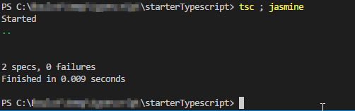

# Abstract

I create a simple project to execute TypeScript with Test

# Prerequisite:

 - nodejs
 - typescript (tsc)
 - jasmine

# For check prerequisite:
```
npm install typescript -g
npm install jasmine -g


tsc -v
jasmine -v
```

# Install dependencies:
```
npm install 
```

# Compile and execute tests :
```
 tsc ; jasmine
 ```

# Result :


